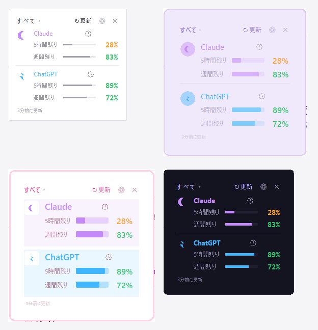

# AI Usage Overlay

> **v0.9 preview** — a Windows prototype. It reads the usage files that Claude
> and Codex save locally and shows the remaining %. It is an unofficial tool,
> unrelated to any AI vendor. The numbers come from locally recorded data, so
> they may lag behind your live usage, and a change in either app's file format
> can stop them from being read.
>
> Known limitations: the Fable weekly value is kept in memory only (it shows
> "—" after a restart until the usage popup is read again); the standalone
> .exe build has not been re-verified for this version.
>
> Verified on: Windows 11 (build 26200), Python 3.13.2.

A tiny always-on-top desktop overlay (Windows) that shows the **remaining %** of
the **5‑hour** and **weekly** usage windows of multiple AI assistants at a
glance — no API keys, no tokens, no login. It just reads the usage files those
apps already write on your PC.

日本語は下 → [日本語](#日本語)



---

## Disclaimer
- This is an **unofficial** desktop overlay UI / tool.
- Not affiliated with, endorsed by, or sponsored by OpenAI, Anthropic, or any
  other AI service provider.
- All icons are original abstract symbols created for this project.
- Brand names are used only for identification purposes.

## How it works
It reads local usage files each app writes for itself (lock‑free, read‑only):

| Provider | Source file | 5‑hour | Weekly |
|---|---|---|---|
| Claude | `%APPDATA%\Claude\plan-usage-history.json`, or for the Microsoft Store build `%LOCALAPPDATA%\Packages\Claude_*\LocalCache\Roaming\Claude\plan-usage-history.json` | `fh` | `sd` |
| ChatGPT / Codex | newest `~/.codex/sessions/**/rollout-*.jsonl` → newest `token_count` event's `rate_limits` (parsed structurally, not text-searched) | `primary` (300 min) | `secondary` (10080 min) |
| others | — (add your own, see below) | — | — |

Only the AIs you actually use will show data; disable the rest in Settings.

The Claude row has a third bar, **Fable weekly**. That number is not in the
usage file, so it is read from the Claude Desktop window while its usage popup
is open (on ↻ Refresh, and once every 5 minutes otherwise). The last value that
could be read is kept for up to 12 hours; after that the bar shows `—`. Reset
times read from the same popup are shown by the 🕐 icon.

## Requirements
- Windows 10/11
- Python 3.9+ with Tkinter (standard), and: `pip install -r requirements.txt`
  (`pywin32`, `pillow`, `pystray`, `comtypes`)
- If you have several Python installations, install into the one the overlay
  will use: `py -3.12 -m pip install -r requirements.txt`.

## Run
- Double‑click **`start.vbs`** (no console window), or run `start.bat`.
  Both look for Python in this order: the `pyw` launcher → `pythonw` on `PATH`
  → the default install locations. If none is found, a dialog tells you how to
  install Python.
- On first run, `badge_config.json` is created from `badge_config.example.json`.
- Stop: `stop.vbs`. Auto‑start on boot: `install_autostart.vbs`
  (undo with `remove_autostart.vbs`).

## Use
- **Move**: drag the window (position is saved).
- **Switch AI**: the dropdown top‑left (All / a single one).
- **⚙ Settings → Theme**: Simple / Pastel / Pop / Neon (applies instantly).
- **⚙ Settings**: enable/disable AIs, rename them, per‑AI color, display mode,
  color‑by‑remaining‑%, opacity, size, refresh interval.
- **↻ Refresh**: re-read now. If Claude's file is stale and the app is closed,
  launches Claude Desktop and waits for the file to update.
- **Click a provider name**: opens its usage page (Claude only for now).
- **🕐 next to a name**: shows the reset times — the ones read from Claude's
  usage popup when available, otherwise the time until each window resets.
  (To open the usage page, click the provider name.)
- **✕**: hide to the system tray; click the tray icon → Show to bring it back.

## Colors (remaining %)
| Remaining | Color |
|---|---|
| more than 60% | green |
| 31–60% | yellow |
| 11–30% | orange |
| 10% or less | red |

## Add another AI
1. In `providers.py`, subclass `Provider`, implement `read(force)` and register
   the class in `REGISTRY`. `read()` returns
   `{ok, five, week, plan, reset_five, reset_week, note, t, stale, url}`.
   `five` / `week` are the **used** % (0–100); the display converts them to the
   remaining %. Use `force=True` only for expensive lookups the user asked for
   (the ↻ button), never on the periodic tick.
2. In `badge_config.json`, add
   `{"id","name","type","enabled","icon","color"}` to `providers`.
   `icon` is one of the abstract motifs (moon, star, crystal, bolt, hex, wave,
   ring, triangle, square, orb, orbit, dots).

## Others
Gemini and other assistants are planned for a future version
(manual input / auto-detect). A provider with no data source (`"type": "none"`)
is hidden from the overlay even when enabled, so the window never shows rows of dashes.

## Build a standalone .exe (optional)
```
pip install pyinstaller
pyinstaller --onefile --noconsole --name AIUsageOverlay ^
  --hidden-import pystray._win32 badge.py
```
The `.exe` appears in `dist\`. It keeps `badge_config.json` next to the exe.
Note: the .exe build has not been re-verified for this version.

---

## 日本語

> **v0.9 preview — Windows向け試作版**
> Claude / Codex が保存するローカルファイルを読み、残り使用率を表示します。各社とは無関係の非公式ツールです。
> 表示はローカルに記録された情報に基づくため、最新の利用状況と一致しない場合があります。各アプリの仕様変更により取得できなくなる可能性があります。
>
> 既知の制限: Fable の週間値はメモリ上だけで保持します（再起動後は使用量ポップアップを読み直すまで「—」）。単体 .exe はこの版で再検証していません。
>
> 動作確認: Windows 11 (build 26200) / Python 3.13.2

複数AIの **5時間枠 / 週間枠の残り%** を、画面の隅に常時最前面で小さく表示する
Windows用オーバーレイです。**APIキーもトークンもログインも不要** — 各アプリが
自分でPCに書き出している使用量ファイルを読むだけ。

### 非公式ツールについて
- 本プロジェクトは**非公式**のデスクトップオーバーレイUI / ツールです。
- OpenAI、Anthropic、その他AIサービス提供元とは提携・承認・協賛関係はありません。
- アイコンは本プロジェクト用に作成したオリジナルの抽象記号です。
- サービス名は識別のためにのみ使用しています。

### しくみ
各アプリがローカルに書き出すファイルを読み取ります（読み取り専用・ロックなし）。

| 対応 | 読むファイル | 5時間枠 | 週間枠 |
|---|---|---|---|
| Claude | `%APPDATA%\Claude\plan-usage-history.json`／Microsoft Store版は `%LOCALAPPDATA%\Packages\Claude_*\LocalCache\Roaming\Claude\plan-usage-history.json` | `fh` | `sd` |
| ChatGPT / Codex | 最新 `~/.codex/sessions/**/rollout-*.jsonl` の最新 `token_count` イベントの `rate_limits`（文字列検索ではなく構造として解析） | `primary`(300分) | `secondary`(10080分) |
| その他 | —（自分で追加可） | — | — |

使っているAIだけ数値が出ます。使っていないものは設定でOFFに。

Claude の行には3本目のバー **Fable 週間残り** があります。この値は使用量
ファイルには入っていないため、Claude デスクトップの使用量ポップアップを
開いているときに画面から読み取ります（↻ 更新時と、ふだんは5分に1回）。
最後に読めた値は12時間まで保持し、それより古くなると「—」になります。
同じポップアップから読んだリセット時刻は 🕐 で確認できます。

### 必要なもの
- Windows 10/11
- Python 3.9+（Tkinter同梱）＋ `pip install -r requirements.txt`
  （`pywin32` / `pillow` / `pystray` / `comtypes`）
- Pythonを複数入れている場合は、使う方に入れてください：
  `py -3.12 -m pip install -r requirements.txt`

### 起動
- **`start.vbs`** をダブルクリック（コンソール無し）／ または `start.bat`
  どちらも pyw ランチャー → `PATH` の `pythonw` → 既定のインストール先 の順に
  Python を探します。見つからないときは入れ方を案内するダイアログが出ます。
- 初回起動時に `badge_config.example.json` から `badge_config.json` が作られます。
- 停止: `stop.vbs`／自動起動: `install_autostart.vbs`（解除: `remove_autostart.vbs`）

### 使い方
- **移動**: 窓をドラッグ（位置保存）
- **AI切替**: 左上ドロップダウン（すべて / 個別）
- **⚙ 設定 → テーマ**: シンプル / パステル / ポップ / ネオン（即時反映）
- **⚙ 設定**: AIのON/OFF・名前変更・AI別カラー・表示モード・残り%で色分け・
  不透明度・サイズ・更新間隔
- **↻ 更新**: その場で読み直します。Claudeのファイルが古く、アプリも閉じている
  ときは Claude デスクトップを起動して、ファイルが新しくなるまで待ちます。
- **AI名をクリック**: そのAIの使用量ページを開きます（今のところClaudeのみ）
- **🕐（名前の右）**: リセット時刻を表示します（Claude の使用量ポップアップから
  読めたときはその時刻、読めないときは各枠の回復までの時間）。
  使用量ページを開くのは「AI名をクリック」です
- **✕**: トレイに格納。トレイのアイコン→「表示」で復帰

### 残り%の色
| 残り | 色 |
|---|---|
| 61%以上 | 緑 |
| 31–60% | 黄 |
| 11–30% | 橙 |
| 10%以下 | 赤 |

### AIを追加する
1. `providers.py` の `Provider` を継承して `read(force)` を実装し、`REGISTRY`
   に登録します。返り値は
   `{ok, five, week, plan, reset_five, reset_week, note, t, stale, url}`。
   `five` / `week` は**使用率**%（0–100）で返し、残り%への変換は表示側で行います。
   重い取得は `force=True`（↻ ボタン）のときだけにして、定期更新では行いません。
2. `badge_config.json` の `providers` に
   `{"id","name","type","enabled","icon","color"}` を1件追加します。

### その他のAI
Gemini など他の AI は今後対応予定です（手動入力／自動検出）。
取得手段の無い AI（`"type": "none"`）は、有効にしていても小窓には表示しません（「—」だけの行を出さないため）。

### ライセンス
MIT License（`LICENSE` 参照）
